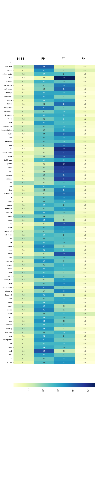
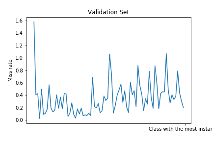
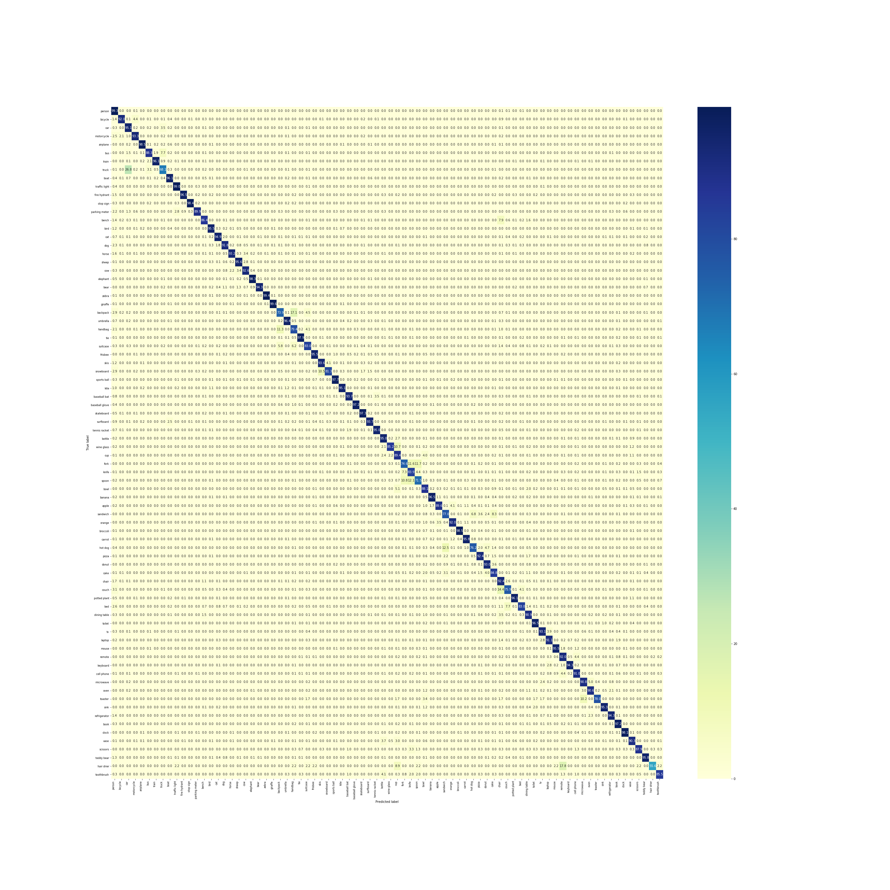

# Mask R-CNN Performance Evaluation with Model trained on COCO dataset

“COCO: Common Objects in Context”1 is a large-scale dataset that contains total of 120,000 images provided with
pixel annotations, bounding boxes, and classs labels for each instance of 80 different object classes. Since annotating
boundaries of an instance in an image is a costly process, there are not as many available datasets for training instance
segmentation models. Its quality and large size has made it the de facto dataset for both training and evaluating object
detection models, particularly the models focusing on instance segmentation tasks such as Mask-RCNN.

When Mask-RCNN makes a prediction, how reliable are the results? When the model is trained, does it perform the
same for all classes it is trained for? How do the number of instances in the training set per class affect the overall
prediction accuracy? Is more better? These are some of the questions that can not be easily answered just by merely
looking at the mIoU score of the network. In this analysis, Mask-RCNN model, trained with COCO dataset with 80k
images, is evaluated on official train and test splits of the COCO dataset to attempt to answer these questions.

## 1-Train vs Train Results
- The below confusion matrix shows the results for bounding box predictions that match with at least 50% of the
ground truths(0.5 IoU threshold). Important to note that the predictions that do match below the threshold and failure of
a prediction on valid objects are not calculated in the result. The result still show how the Mask-RCNN model confuses
presented objects with each other.
- Intuitively, visually similar objects like fork and spoon have high confusion rates compared to other visually unique
classes like zebra and train. However, It can be said from the confusion matrix that learning on training data is quite
sufficient as most objects have low confusion rates.

  
  
Table 1: Confusion Matrix @0.5 IoU

### Precison, Recall and F1 Scores at different thresholds:

When missed instances and predictions that are not matched with any ground truth area are also taken into
account, how well each class is learned can be seen more clearly. As expected, when the threshold condition increases,
the scores generally decrease. However, some classes are more resilient to this decrease than others. This could be
attributed to several factors. Resilient classes such as ‘stop sign’, ‘frisbee’, ‘traffic light’ have more static shapes in
general and have less shape complexity, meaning less detailed extensions attached to main frame of the object, thus
easier to locate all of the pixels belonging to the object. Another reason might be is they are simply learned better.

A notebook with the demo can be found in [demo/Evaluate_Models.ipynb](demo/Evaluate_Models.ipynb).

  
  
Illustration 1: Precision Scores of the training set

  
  
Illustration 2: Recall Scores of the training set

  
  
Illustration 3: F-1 Scores of the training set

In the table below, classes are listed in increasing order according to how many instances of each class the network
trained with. For example, lowest is ‘hair drier’ class with 135 instances and highest is ‘person’ class with 185289
instances that were used in training the network. It is clear that adding more data doesn’t necessarly mean better
performance and some of the better performing classes are those with lower amounts. It could also be argued that adding
more data can decrease the class wise performance sometimes, as in the case with ‘book’ class. Total of 17307 instances
were used in training to achieve highest false positive score. In other words, the network over finds books.In the table below, classes are listed in increasing order according to how many instances of each class the network
trained with. For example, lowest is ‘hair drier’ class with 135 instances and highest is ‘person’ class with 185289
instances that were used in training the network. It is clear that adding more data doesn’t necessarly mean better
performance and some of the better performing classes are those with lower amounts. It could also be argued that adding
more data can decrease the class wise performance sometimes, as in the case with ‘book’ class. Total of 17307 instances
were used in training to achieve highest false positive score. In other words, the network over finds books.

  
  
Illustration 4: The Class Table

- Also when precision of a class increases, miss rate tends to drop.
- Miss Rate defined as : Number of missed instances per True detection.

  
  
Illustration 5: The Val- Comparison

## 2-Validation Results

- Observations made in training section all hold true for validation results, meaning COCO dataset is large enough that
training on it provides generalized results.

  
  
Table 2: Confusion Matrix @0.5 IoU

  
  
Illustration 5: Precision Scores of Validation

  
  
Illustration 6: Recall Scores of Validation

  
  
Illustration 7: F1 Scores of Validation

### Precision wise top performing classes, from worst to best:

Top performing classes are mostly animals. Could be because in scenes they are present, they are more likely to be
the focus of the image and there are probably fewer objects blocking them. Could also be because they differ less in
appearence in general and can’t be easily visually mistaken for other objects, e.g. hardly anything looks like a giraffe
apart from a giraffe.

It is also possible that because backbone architecture(ResNet 101) is pretrained on ImageNet, which is famous for its
vast number of animal pictures, they can be trained much faster with less amount of data.

***There will be a 'MISS FP TP FN' table here, dont have the png for it for now*** 

***There will be the 'Highest Precision- Miss Rate' table here, dont have the png for it for now*** 

## 3-Train-Validation Comparisons

Results are obtained by substracting validation results from train results.

As can be seen from the table and plottings, differences aren’t big enough to suspect generalization capability of the
network.

***There will be the 'F1 Score Difference at Different Thresholds' here, dont have the png for it for now*** 

***There will be 'Train Recall Minus Validation Recall at Different Thresholds' here, dont have the png for it for now*** 

***There will be 'Presicion Difference at Different Thresholds' here, dont have the png for it for now*** 

***There will be the 'Difference table of Train Minus Val Comparison' table here, dont have the png for it for now*** 

